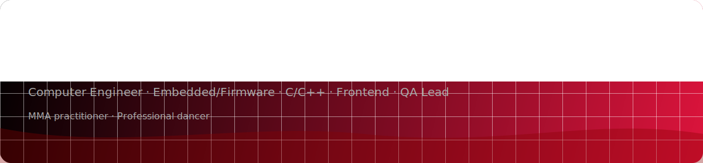
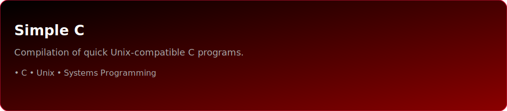
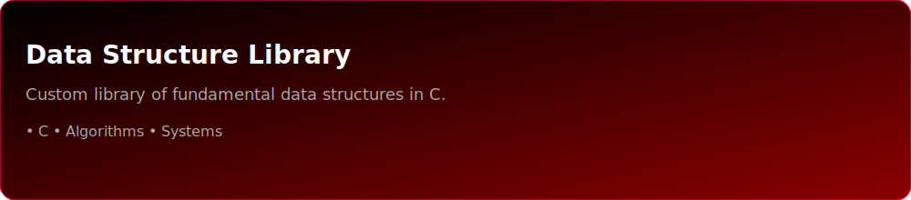
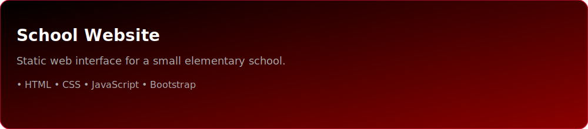

  

---

## 🧑‍💻 About Me
- 🎓 Computer Engineering @ SFU (Class 2025)  
- ⚡ Experienced in **C/C++**, firmware, embedded systems, and **frontend development**  
- ✅ Former **QA Lead**, ensuring scalable, high-quality solutions  
- 🥋 Trains in **MMA** | 💃 Professional dancer — disciplines that sharpen creativity, resilience, and focus  

---

## 🛠 Skills

  
  
  
  
  
  
  
  

---

## 📂 Featured Projects

  

  

  

---

## 📊 GitHub Stats

  

  

  

---

## 🌐 Connect with Me

  
  

---
